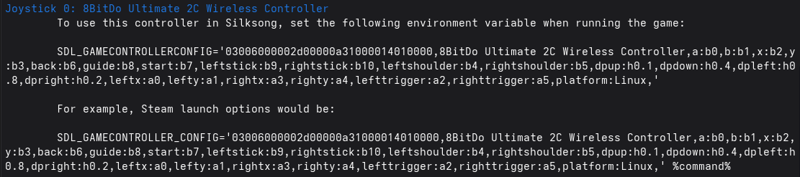

## Silksong on Linux controller fix

## Background

On the native Linux version of Silksong, the game acts very strangely once you
get abilities using the right or left triggers. This includes, but is not
limited to, the 8BitDo Ultimate 2C Wireless controller.

The game is normal on startup before right trigger has ever been pressed. Once
it has been pressed, it seems to activate on a soft pull and not deactivate, or
briefly deactivate then reactivate unpredictably. When Hornet climbs up a ledge,
Swift Steps will be reactivated even if it is off and the button is not pressed
in.

The same issue affected Hollow Knight, with the Crystal Dash ability. However,
this could be worked around by setting the SDL_DYNAMIC_API environment variable
in the launch options in Steam. For example:

```
SDL_DYNAMIC_API=/usr/lib/x86_64-linux-gnu/libSDL2-2.0.so.0 %command%
```

The same does not work in Silksong, however. Occurrences of `SDL_DYNAMIC_API`
are present in UnityPlayer.so in Hollow Knight, but not in Silksong. Running
Hollow Knight with LD_DEBUG on with no launch options results in no mention of
SDL, indicating a statically linked version was used. With the launch option, it
shows that the library provided is loaded. For Silksong, no system SDL is
loaded, whether or not an SDL_DYNAMIC_API or SDL3_DYNAMIC_API environment
variable is set.

## Fix


Requirements:

- SDL3
- gcc, or another C compiler

### 1. Disable NativeInput in Silksong:

In the file `~/.config/unity3d/Team\ Cherry/Hollow\ Knight\ Silksong/AppConfig.ini`, change `NativeInput=1` to `NativeInput=0`.

### 2. Get SDL3 game controller config and modify it to be compatible with Silksong

#### 8BitDo Ultimate 2C Wireless Controller

If you have the 8BitDo Ultimate 2C Wireless Controller here's the config and you can skip the other steps:

```sh
# If you are using Steam, copy the following into Steam launch options
SDL_GAMECONTROLLERCONFIG='03000000c82d00000a31000014010000,8BitDo Ultimate 2C Wireless Controller,a:b0,b:b1,x:b2,y:b3,back:b6,guide:b8,start:b7,leftstick:b9,rightstick:b10,leftshoulder:b4,rightshoulder:b5,dpup:h0.1,dpdown:h0.4,dpleft:h0.8,dpright:h0.2,leftx:a0,lefty:a1,rightx:a3,righty:a4,lefttrigger:a2,righttrigger:a5,platform:Linux,' %command%
# If you are running the game some other way, set the following environment variable when starting it
SDL_GAMECONTROLLERCONFIG='03000000c82d00000a31000014010000,8BitDo Ultimate 2C Wireless Controller,a:b0,b:b1,x:b2,y:b3,back:b6,guide:b8,start:b7,leftstick:b9,rightstick:b10,leftshoulder:b4,rightshoulder:b5,dpup:h0.1,dpdown:h0.4,dpleft:h0.8,dpright:h0.2,leftx:a0,lefty:a1,rightx:a3,righty:a4,lefttrigger:a2,righttrigger:a5,platform:Linux,'
```

Be careful, because this config won't work for a model that is even slightly different. If you have a different controller that also exhibits weird behavior, follow the steps in "Other models".

#### Other models

C code is provided that simplifies this as much as possible.

- Acquire the code provided in this repository, either by cloning or by downloading `get_controller_config.c` directly
- `cd` into the folder in which you downloaded the C source file.
- Compile the C source:

```sh
cc -o get-controller-config get_controller_config.c -lSDL3
```

- Ensure the controller you want to use with Silksong is connected to you computer and not idle
- Run the program

```sh
./get-controller-config
```

This produces an output like the following:



If you are using Steam, you can copy the provided launch options string into the
Steam launch options. If you are running Silksong directly, you will need to set
the environment variable for whatever command you are using to start it.

Many thanks to kakonema for finding the fix. C code implementing this provided by me.
